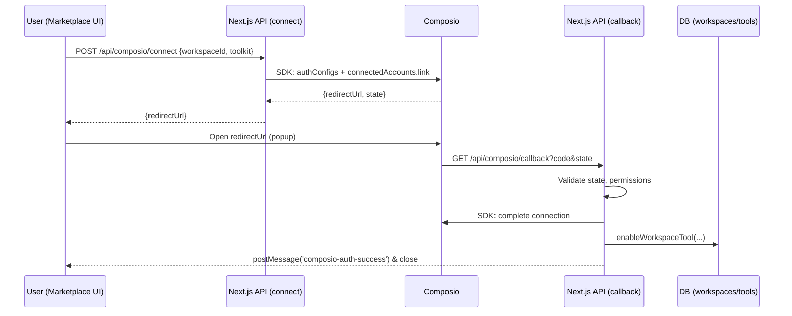

# Refactor Plan — Composio-powered AI Tool Marketplace

Date: 2025-09-28

## Executive Summary

- Eliminate NaN workspace ID defects by centralizing ID parsing/validation and enforcing strong typing at API boundaries and in React context. This unblocks all OAuth/API‑key flows and workspace features [5].
- Consolidate on the official TypeScript SDK (`@composio/core`) for all auth, connection, and tool operations. Remove the custom HTTP wrapper to avoid drift and inconsistencies [1][2][3].
- Normalize the connection flows (OAuth and API key) and callback handling, preserving user/workspace isolation patterns and reliable postMessage close-out UX [5].
- Add observability (structured logs, trace IDs) and defensive validation to surface misrouted IDs or missing params early, with comprehensive integration tests across flows.
- Deliver the refactor in clear phases with measurable milestones, gating later work on the workspace ID fix.

---

## Context and Current Issues

From the issues log, two blockers are outstanding:

1) Persistent NaN workspace ID database errors (critical). Symptoms include invalid inputs for integer columns, indicating one or more pathways are injecting non-numeric `workspaceId` (e.g., `NaN`) into DB calls and/or route handlers [5].
2) Workspace management system issues (ID handling across frontend context, routes, and DB). Switching workspaces can crash, API routes sometimes receive invalid IDs [5].

Previously resolved items (COOP, OAuth option rendering, callback postMessage, API key endpoints, port normalization) provide a good baseline, but the two issues above still block end-to-end testing [5].

On the integration side, the repository currently mixes two approaches:

- A custom REST wrapper around Composio endpoints in `lib/composio.ts`.
- The official TypeScript SDK usage in `lib/composio-mcp.ts` and tests, with some API deltas across versions [3][5].

Per Composio’s platform guidance, the SDK centralizes auth, tool normalization, and execution, with fine-grained permissions, triggers, and modifiers/hook support for robust production usage [1]. The refactor will align strictly to the SDK to reduce surface for divergence.

---

## Objectives

- Reliability: No NaN or invalid IDs reach the database or route handlers; errors are caught and logged at boundaries.
- Consistency: One Composio integration path using `@composio/core` across OAuth and API key flows.
- Security & Isolation: Maintain clear user/workspace isolation in Composio `user_id` mapping, consistent with personal vs. company workspace patterns [5].
- Testability: Deterministic integration tests for OAuth and API key flows, including callback and UI messaging.
- Maintainability: Reduce duplicate logic, standardize request validation and typing, and document flows.

---

## Target Architecture

### 1) Identity & ID Handling

- Introduce branded numeric types for IDs and a single conversion/validator.
- Enforce validation at boundaries (routes, context) and remove ad‑hoc `parseInt` usage scattered across code.
- Store `currentWorkspaceId` in `localStorage` as a string, but parse/validate before any network call.

Example boundary schema (TypeScript + Zod):

```ts
import { z } from 'zod'

export const idParamSchema = z.string().regex(/^\d+$/).transform((s) => Number(s))
export const numericIdSchema = z.number().int().positive()

// Usage in route handlers
const workspaceId = idParamSchema.parse(params.id)
```

Optionally define branded IDs to prevent mixing at compile time:

```ts
type Brand<T, B extends string> = T & { __brand: B }
export type WorkspaceId = Brand<number, 'WorkspaceId'>
export type UserId = Brand<number, 'UserId'>
```

Centralize conversions (single source of truth) and remove redundant `parseInt` calls. Keep `parseId` in DB layer as a safety net only.

### 2) Composio Integration (SDK-first)

- Standardize on `@composio/core` for all auth/config/connection flows. Avoid the custom REST wrapper in `lib/composio.ts` to reduce API drift [1][2][3].
- Normalize SDK usage to the installed version (`@composio/core@^0.1.53`):
  - Create or find an Auth Config for the target app/toolkit.
  - OAuth: use `connectedAccounts.link(userId, authConfigId, { callbackUrl, state })`.
  - API Key: use `connectedAccounts.initiate(userId, authConfigId, { config: { authScheme: 'API_KEY', val: { api_key: '…' } } })`.
  - Tools: use `composio.tools.get(userId, { toolkits: ['github'] })` and provider integration as needed [1][3].

Reference patterns and capabilities (fine-grained permissions, triggers, modifiers/hooks) are documented by Composio, and should be leveraged where relevant to tighten security and reliability [1][2].

Representative snippets (to be adapted to the exact SDK surface of the pinned version):

```ts
import { Composio } from '@composio/core'

const composio = new Composio({ apiKey: process.env.COMPOSIO_API_KEY! })

// 1) Ensure an auth config exists (pattern varies by version)
const authConfig = await composio.authConfigs.create({
  app: 'github',
  authMode: 'OAUTH2',
  config: {},
})

// 2) OAuth link
const linkReq = await composio.connectedAccounts.link(
  userId, // e.g., user_123 or org_45
  authConfig.id,
  { callbackUrl, state }
)

// 3) API Key connection
const apiKeyReq = await composio.connectedAccounts.initiate(
  userId,
  authConfig.id,
  { config: { authScheme: 'API_KEY', val: { api_key: SECRET } } }
)
```

### 3) User/Workspace Isolation

- Continue the current pattern: for personal workspaces, use `user_${userId}`; for company workspaces, use `org_${workspaceId}` as the Composio `user_id`, ensuring shared org connections vs. per-user connections [5].
- Validate state payloads (`userId`, `workspaceId`, `toolkit`, nonce, timestamp) on callback, and enforce origin checks for postMessage in the OAuth dialog [5].

### 4) API and UI Flow

- `/api/composio/connect` creates the auth session and returns a redirect URL.
- OAuth window returns to `/api/composio/callback`, which validates state and updates `workspace_tools`. For marketplace flows, it replies with an HTML page that `postMessage`s success and self-closes; otherwise redirect to the workspace tools page [5].
- The `OAuthDialog` already supports both OAuth and API key paths and shows the supported auth schemes (uppercase) [5].

Mermaid overview of the OAuth flow:



---

## Implementation Plan (Phased)

### Phase 0 — Preflight (0.5–1 day)

- Pin `@composio/core` to the known-good version in `package.json` and lock file. Confirm the SDK method signatures with a small harness (e.g., update `test-composio-fixed.js`) [5].
- Verify `NEXTAUTH_URL` and dev port (3001) are consistent across `.env.local` and Next.js config [5].

### Phase 1 — Workspace ID Reliability (1–2 days)

- Introduce `idParamSchema` and branded IDs; refactor API routes to use them (e.g., `app/api/workspaces/[id]/route.ts`, `app/api/workspaces/[id]/tools/route.ts`).
- In `WorkspaceProvider`, validate IDs before network calls; refuse switches when invalid; log with clear telemetry (userId, prev/current workspaceId) [5].
- Keep DB `parseId` as a backstop; add structured logs when it rejects input, to catch any remaining sources.
- Add request-level logging (only in dev) to trace `workspaceId` from UI → routes → DB.

### Phase 2 — Unify Composio Integration (1–2 days)

- Create `lib/composioClient.ts` that wraps the SDK patterns for this version (auth config ensure/find, OAuth/API‑key connect, status, tools). Remove `lib/composio.ts` after migration.
- Update `app/api/composio/connect` to call the unified client method (OAuth link) and remove duplicate state/auth code paths.
- Update API‑key flows to use SDK `connectedAccounts.initiate` with `{ authScheme: 'API_KEY', val: {...} }` and persist connection metadata in `workspace_tools` as done for OAuth [3][5].
- Keep MCP-specific pieces in a thin layer only if/when required by the product; otherwise, favor the simpler connection patterns the SDK already supports [1].

### Phase 3 — Callback & Post-Auth UX (0.5–1 day)

- Ensure callback validates state strictly and rejects user/workspace mismatches. Maintain the marketplace popup self-close with `postMessage` semantics [5].
- Add defensive handling for both traditional OAuth and Composio-hosted auth parameters as currently implemented [5].

### Phase 4 — Tests & Tooling (1–2 days)

- Unit tests: ID parsing/validation utilities; route handlers with valid/invalid IDs.
- Integration tests: mocked OAuth roundtrip (state encode/decode, callback), marketplace popup messaging, API key connect.
- Smoke tests: fetch tools for a connected account; ensure no `NaN` appears in server logs/DB.

### Phase 5 — Observability & Hardening (0.5–1 day)

- Add structured logging around ID flows, connection attempts, and callback outcomes. Consider adding correlation IDs per request.
- Rate-limit connect endpoints and add explicit error surfaces for user remediation (e.g., “connect your account first”).

### Phase 6 — Cutover (0.5 day)

- Remove the deprecated `lib/composio.ts` once all usages are migrated to the SDK-based client.
- Re-run E2E tests. Update docs in `/docs` to reflect the final flow.

---

## File-by-File Changes (High Level)

- `lib/contexts/workspace-context.tsx`: Validate/sanitize IDs before calling APIs; persist only valid `currentWorkspaceId`.
- `app/api/workspaces/[id]/route.ts` and `.../tools/route.ts`: Replace ad‑hoc `parseInt` with `idParamSchema`; ensure `session.user.id` is validated and converted to number once.
- `lib/db/queries.ts`: Keep `parseId` as a last-resort guard; add structured logging on failures.
- `lib/composioClient.ts` (new): Encapsulate all Composio SDK calls for this project’s version; provide typed methods for OAuth link, API‑key connect, status, tools.
- `app/api/composio/connect/route.ts`: Use the client for OAuth link; simplify and centralize state handling.
- `app/api/composio/callback/route.ts`: Keep dual-path handler (traditional vs hosted) but use shared validators and client completion logic.
- `components/marketplace/oauth-dialog.tsx`: No major changes; ensure origin checks remain in place and errors are surfaced nicely.

---

## Risks & Mitigations

- SDK surface changes: The SDK evolves; pin the version and adapt usage to it. Add a light verification test that fails loudly on API signature changes [3][5].
- Residual ID sources: If any legacy path still pushes invalid IDs, the route-level validators will fail fast and log details for triage.
- OAuth provider variance: Keep generous callback parameter parsing (already implemented) with strict state/user/workspace checks [5].

---

## Success Criteria

- No `NaN` or invalid workspace IDs recorded in logs or DB during workspace switching or tool operations.
- Successful end-to-end OAuth and API‑key connections with tools showing as enabled in the correct workspace.
- All integration tests for connect/callback/API‑key pass locally and in CI.
- Only one Composio integration surface (`@composio/core`) remains in the codebase.

---

## Follow-ons (Nice to Have)

- Adopt Composio modifiers and input/output hooks for reliability on tool calls (e.g., normalizing arguments; pruning outputs) [1][2].
- Explore triggers to initiate workflows from external events (Slack/GitHub) as marketplace features expand [1].

---

## Sources

1. Composio — Welcome to Composio (capabilities: 3000+ tools, permissions, triggers, modifiers, hooks) — https://docs.composio.dev/docs/welcome
2. Local docs — Composio Migration Guide (API evolution, new Composio class patterns) — `composio-docs/migration.md`
3. Local docs — Development Setup (TS/JS SDK and MCP snippets; version examples) — `composio-docs/dev-setup.md`
4. Local docs — MCP Overview (standardized protocol, how Composio uses MCP) — `composio-docs/mcp/overview.md`
5. Project — Issues Log (current blockers, resolved issues, file map) — `issues.md`

---

## Addendum — Alignment with External Review Findings (2025-09-28)

Summary of additional insights and how this plan adapts:

- Zero-NaN guarantee: Adopt a single `parseIdStrict` utility and Zod `idSchema` via `z.preprocess` to prevent `NaN` from `Number()`/`transform`. Replace all ad‑hoc `parseInt` uses at route boundaries. Keep DB `parseId` as a last-resort guard with structured logs on failure.
- DB mutation hardening: In `createWorkspace`, normalize and validate `owner_id` prior to insert; fail fast with descriptive errors instead of passing through unvalidated values.
- Centralized guards: Add `lib/api/guards.ts` with `requireSession`, `requireWorkspaceMember`, `requireWorkspaceAdmin` to consolidate membership/role checks and ID parsing across routes.
- Integration unification: To adhere to Composio’s recommended patterns, this plan chooses SDK‑first unification on `@composio/core` and deprecates the custom HTTP wrapper (`lib/composio.ts`). We will port any missing “complete/status” helpers into the SDK facade and ensure a single state encoder/decoder is exported and reused by both connect and callback.
- Frontend safety: Brand `WorkspaceId`, validate restored IDs from `localStorage` before invoking network calls, and prefer returning camelCase from API routes to reduce client-side normalization drift.

High‑impact patch set (PR‑1):

1) Utilities
   - `lib/utils/ids.ts`: `parseIdStrict(value, name)`, `zId()`/`idSchema` helpers.
2) DB layer
   - `lib/db/queries.ts#createWorkspace`: validate `owner_id` using strict parsing; log/throw on invalid.
3) API schemas
   - Replace `z.string().transform(Number)` with `z.preprocess(v => Number(v), z.number().int().positive())` and `.refine(Number.isFinite, 'Invalid numeric ID')` where applicable (e.g., `/api/composio/connect`, workspace routes).
4) Route guards
   - `lib/api/guards.ts`: `requireSession`, `requireWorkspaceMember`, `requireWorkspaceAdmin`; refactor `app/api/workspaces/[id]` and `.../[id]/tools` to use them.
5) Composio unification
   - Create `lib/composioClient.ts` (SDK facade) consolidating: ensure/find authConfig, `connectedAccounts.link`, API‑key `initiate`, `getConnectedAccounts` status, and state helpers. Migrate `/api/composio/connect` and `/api/composio/callback` to this facade. Deprecate `lib/composio.ts` after migration.

Decision:

- Proceed with SDK‑first unification on `@composio/core` and deprecate the custom HTTP client (`lib/composio.ts`). All connect/callback/status logic will be consolidated behind a new SDK facade (`lib/composioClient.ts`).

Proposed next steps (confirmed):

- Implement PR‑1 (utilities, DB hardening, schema fixes, guards, SDK facade) → run smoke tests to validate no `NaN` reaches the DB and that connect/callback still complete with identical response shapes.
- Follow with PR‑2 to refactor remaining routes to guards/utilities and remove the deprecated client.
